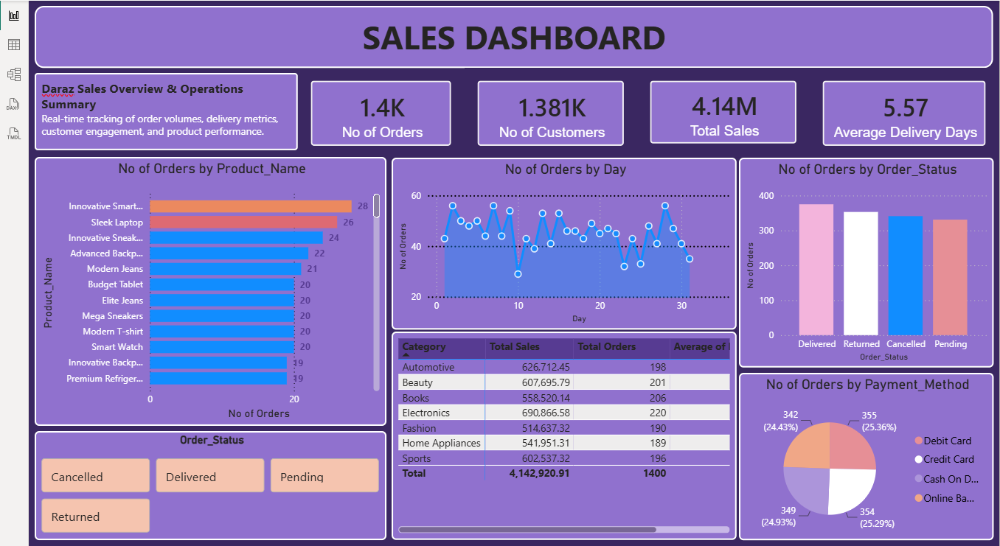

# 🛒 Daraz Sales Analysis & Operations Dashboard

An end-to-end **e-commerce sales analytics project** built around a Daraz-style retail dataset. The project combines **Python-based Exploratory Data Analysis (EDA)** with an interactive **Power BI dashboard** to evaluate sales, orders, customers, products, categories, delivery performance, order status, and payment behavior.

**Workflow:** CSV Dataset → Python / Google Colab → Data Inspection & EDA → Feature Engineering → Power BI Dashboard → Business Insights

> **Note:** This project uses a synthetic e-commerce dataset for learning and portfolio purposes. It is not official Daraz operational data.

## 📊 Dashboard Preview



## 🎯 Project Objective

The goal is to turn raw e-commerce transaction data into useful business insights by answering questions such as:

- How many orders and customers are represented?
- What is the overall sales value?
- Which categories generate the highest sales?
- Which products have the highest order quantities?
- How are orders distributed across statuses?
- Which payment methods are most commonly used?
- How long do customers typically wait for delivery?
- How does order volume change over time?

## 📦 Dataset Overview

The dataset contains **1,400 order records**, **1,381 unique customers**, and **100 products** across **7 product categories**.

| Column | Description |
|---|---|
| `Order_ID` | Unique identifier for each order |
| `Customer_Name` | Customer name |
| `Customer_City` | Customer location/city |
| `Product_Name` | Product purchased |
| `Category` | Product category |
| `Price` | Product price |
| `Quantity` | Quantity ordered |
| `Order_Date` | Date the order was placed |
| `Delivery_Date` | Date the order was delivered |
| `Payment_Method` | Payment method used |
| `Order_Status` | Current order status |
| `Seller_Name` | Seller associated with the order |

### Categories
Automotive • Beauty • Books • Electronics • Fashion • Home Appliances • Sports

### Order Statuses
Delivered • Returned • Cancelled • Pending

### Payment Methods
Debit Card • Credit Card • Cash On Delivery • Online Banking

## 🐍 Python / Google Colab EDA

The dataset was analyzed in **Google Colab using Python** with:

- **Pandas** — data loading, inspection, transformation and aggregation
- **NumPy** — numerical operations
- **Matplotlib** — visualization
- **Seaborn** — statistical visualization

The notebook performs dataset inspection using `head()`, `info()`, `describe()`, missing-value checks and duplicate checks. The analysis confirmed **1,400 rows, 12 columns, no missing values, and no duplicated rows**.

## 🧹 Data Preparation & Feature Engineering

The order and delivery date columns were converted to datetime and a new `Delivery_Days` feature was created:

```python
df['Delivery_Days'] = (
    df['Delivery_Date'] - df['Order_Date']
).dt.days
```

This enabled delivery-duration analysis. Delivery times in the dataset range from **1 to 10 days**.

The EDA also examined order status, category performance, delivery duration, product demand and quantity distribution.

## 🔎 Exploratory Data Analysis

### Order Status Distribution

| Status | Orders |
|---|---:|
| Delivered | 375 |
| Returned | 353 |
| Cancelled | 341 |
| Pending | 331 |

### Category Quantity Performance

| Category | Quantity |
|---|---:|
| Electronics | 655 |
| Beauty | 602 |
| Sports | 590 |
| Books | 589 |
| Home Appliances | 571 |
| Automotive | 570 |
| Fashion | 553 |

**Electronics** recorded the highest total quantity at **655 units**.

### Top Products by Quantity

| Product | Quantity |
|---|---:|
| Sleek Laptop | 88 |
| Innovative Smartwatch | 75 |
| Budget Smartwatch | 69 |
| Innovative Sneakers | 67 |
| Sleek Smartwatch | 63 |
| Advanced Backpack | 63 |
| Budget Tablet | 63 |
| Elite Jeans | 63 |
| Mega Sneakers | 58 |
| Modern Jeans | 58 |

**Sleek Laptop** was the highest-volume product with **88 units ordered**.

## 📊 Power BI Dashboard

The cleaned and analyzed dataset was used to build an interactive **Power BI sales and operations dashboard**.

### Executive KPIs

| KPI | Value |
|---|---:|
| No. of Orders | **1.4K** |
| No. of Customers | **1.381K** |
| Total Sales | **4.14M** |
| Average Delivery Days | **5.57** |

### Dashboard Visuals

- **Orders by Product** — identifies high-demand products.
- **Orders by Day** — shows daily order-volume fluctuations.
- **Orders by Order Status** — compares Delivered, Returned, Cancelled and Pending orders.
- **Sales & Orders by Category** — compares category performance.
- **Orders by Payment Method** — shows customer payment preferences.
- **Order Status Filters** — allows interactive filtering by status.

## 💰 Category Sales Performance

| Category | Total Sales |
|---|---:|
| Electronics | 690,866.58 |
| Automotive | 626,712.45 |
| Beauty | 607,695.79 |
| Sports | 602,537.32 |
| Books | 585,520.14 |
| Home Appliances | 541,951.31 |
| Fashion | 514,637.32 |
| **Total** | **4,142,920.91** |

**Electronics** is the strongest category by sales at approximately **690.87K**, while **Fashion** has the lowest category sales.

## 💡 Key Business Insights

1. The dataset contains **1,400 orders** from **1,381 unique customers**.
2. Total sales are approximately **4.14M**.
3. **Electronics** is the strongest category by both sales and total quantity.
4. **Sleek Laptop** is the highest-volume product with **88 units ordered**.
5. **Delivered** is the largest order-status group with **375 orders**.
6. Average delivery time is **5.57 days**, with individual delivery durations ranging from **1–10 days**.
7. Payment-method analysis provides visibility into customer purchasing preferences.
8. Daily order analysis helps identify demand fluctuations and potential operational peaks.

## 🔄 End-to-End Workflow

```text
             Raw CSV Dataset
                    │
                    ▼
          Python / Google Colab
                    │
        ┌───────────┴───────────┐
        ▼                       ▼
  Data Inspection          Data Cleaning
        │                       │
        └───────────┬───────────┘
                    ▼
          Exploratory Data Analysis
                    │
                    ▼
          Feature Engineering
             Delivery_Days
                    │
                    ▼
              Power BI
                    │
                    ▼
        Interactive Dashboard
                    │
                    ▼
           Business Insights
```

## 🛠️ Tools & Technologies

**Python • Pandas • NumPy • Matplotlib • Seaborn • Google Colab • Power BI • CSV • GitHub**

| Technology | Purpose |
|---|---|
| Python | Data analysis and EDA |
| Pandas | Data manipulation and aggregation |
| NumPy | Numerical analysis |
| Matplotlib | Data visualization |
| Seaborn | Statistical visualization |
| Google Colab | Python analysis environment |
| Power BI | Interactive dashboard and reporting |
| CSV | Source dataset |
| GitHub | Version control and portfolio |

## 📁 Repository Structure

```text
Sales-Analysis/
│
├── Daraz_Sales.pbix
├── Daraz_Sales_EDA.ipynb
├── daraz_sales.csv
├── dashboard.png
├── README.md
└── LICENSE
```

## 🚀 Future Improvements

- Add monthly and yearly sales trends
- Add profit and margin analysis
- Add customer segmentation
- Analyze repeat vs. one-time customers
- Add seller-level performance analysis
- Add city/region-level sales analysis
- Add return and cancellation rate KPIs
- Analyze delivery performance by category and seller
- Add interactive date-range filters
- Add sales and order forecasting
- Connect Power BI directly to a database for automated refresh

## 📌 Project Outcome

This project demonstrates a practical **data analytics and business intelligence workflow**: starting with raw e-commerce transaction data, validating and exploring it in Python, engineering delivery-time metrics, and presenting the results through an interactive Power BI dashboard.

It showcases practical skills in:

**Python • Pandas • NumPy • EDA • Data Cleaning • Feature Engineering • Data Visualization • Power BI • KPI Reporting • Business Intelligence • Sales Analytics**

## 📄 License

This project is available under the MIT License.
